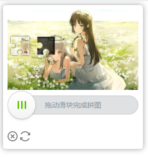
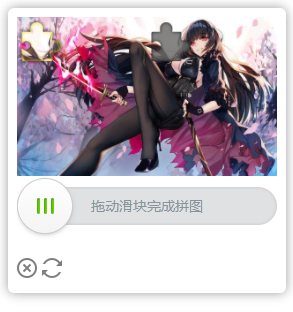

# 这是 滑块验证码(tianai-captcha)的springboot启动类
## [在线体验](https://www.tianai.cloud)
## 验证码demo移步 [tianai-captcha-demo](https://gitee.com/tianai/tianai-captcha-demo)
## 不说废话，直接上代码

```xml
<!-- maven导入 -->
<dependency>
    <groupId>cloud.tianai.captcha</groupId>
    <artifactId>tianai-captcha-springboot-starter</artifactId>
    <version>1.2.7</version>
</dependency>
```

- 注解版风格
```java
// 只需要在需要验证的controller层加入 @Captcha 注解，
// 并且接受的参数指定成CaptchaRequest即可自动进行校验
// 自己真实的参数可以写到 CaptchaRequest对象的泛型中
// 如果校验失败，会抛出CaptchaValidException异常
// 对校验失败的处理，可以使用sping的全局异常拦截CaptchaValidException异常进行处理

@Captcha
@PostMapping("/login")
public ApiResponse login(@RequestBody CaptchaRequest<LoginForm> request) {
    // 进入这个方法就说明已经校验成功了
}
```
-  编码式风格

```java
import cloud.tianai.captcha.template.slider.validator.SliderCaptchaTrack;

public class Test {
    @Autowired
    private SliderCaptchaApplication application;

    public void test() {
        // 生成滑块验证码 该方法会通过request获取浏览器内核是否是谷歌内核，如果是则返回webp类型的图片 否则返回jpeg+png类型的图片
        // 也可以手动指定返回哪种类型的 只需要在request中提供 key为captcha-type的参数(可以放到参数中或者header中) ， 值为 webp、jpeg-png
        // 来通过参数选择返回哪种类型的图片
        CaptchaResponse<SliderCaptchaVO> res1 = application.generateSliderCaptcha();

        // 也可以用编码判断返回哪种类型的图片, 返回webp类型的图片
        res1 = application.generateSliderCaptcha(CaptchaImageType.WEBP);
        // 返回 底图是jpeg，滑块部分是png类型的图片
        res1 = application.generateSliderCaptcha(CaptchaImageType.JPEG_PNG);
        // 其它扩展方法可以自己在源码中查看,都有详细注释
        
        // 匹配验证码是否正确
        // 该参数包含了滑动轨迹滑动时间等数据，用于校验滑块验证码。 由前端传入
        SliderCaptchaTrack sliderCaptchaTrack = new SliderCaptchaTrack();
        boolean match = application.matching(res1.getId(), sliderCaptchaTrack);
    }

}
```


- 前端展示效果




- springboot配置文件说明
```yaml
# 滑块验证码配置， 详细请看 cloud.tianai.captcha.autoconfiguration.SliderCaptchaProperties 类
captcha:
  slider:
    # 如果项目中使用到了redis，滑块验证码会自动把验证码数据存到redis中， 这里配置redis的key的前缀,默认是captcha:slider
    prefix: |-
      captcha:slider
    # 验证码过期时间，默认是1分钟,单位毫秒， 可以根据自身业务进行调整
    expire: 60000
    # 使用加载系统自带的资源， 默认是true
    init-default-resource: false
    # 验证码会提前缓存一些生成好的验证数据， 默认是20
    cacheSize: 20
    # 因为缓存池会缓存 webp 和jpg+png 两种类型的图片， 所有这里可以配置webp生成的数量， 默认是 总缓存的70%(captcha.cacheSize*0.7)
    webp-cache-size: 16
    # 缓存拉取失败后等待时间 默认是 5秒钟
    wait-time: 5000
    # 缓存检查间隔 默认是2秒钟
    period: 2000
    # 是否加入混淆滑块，默认不加入
    obfuscate: false
```
- 该自动装配器可以自动选择redis做缓存还是缓存到本地，自动进行识别装配
- 本地缓存参考了本人写的 [expiring-map](https://gitee.com/tianai/expiring-map) (使用redis淘汰策略) 做过期处理, 有兴趣可以看一下
- 关于[tianai-captcha](https://gitee.com/tianai/tianai-captcha)
- 扩展接口
    - ResourceStore 资源存储器，负责存档图片资源和滑块模板
    - SliderCaptchaResourceManager 资源调度器，负责随机取滑块模板和 背景资源
    - SliderCaptchaTemplate 滑块验证码模板，核心接口，负责生成展示的滑块底图和 滑块图片
    - SliderCaptchaValidator 滑块验证器，负责校验用户滑动的轨迹数据 校验用户滑动使用正确或者判断是否是机器人操作
    - SliderCaptchaApplication 滑块应用程序，上面一些接口的组合和增强，比如负责把验证的数据存到缓存中，用户一般直接使用这个接口方便的生成滑块图片和校验数据
    - 可以自定义这些接口的实现注入到spring中替换默认的实现

- qq群: 1021884609
 